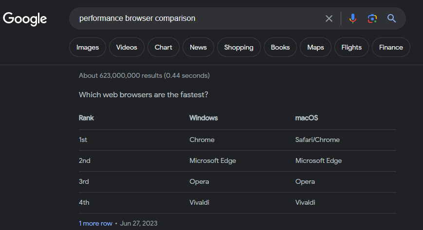
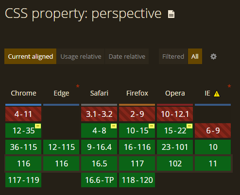

# Chapter 01
### Cơ chế hoạt động của internet:
*Internet hoạt động dựa trên một hệ thống phức tạp của các giao thức mạng và cơ sở hạ tầng kỹ thuật. Dưới đây là một cái nhìn tổng quan về cơ chế hoạt động của Internet:*
1. Giao thức IP (***Internet Protocol***): IP là lõi của Internet. Nó làm nhiệm vụ định danh và địa chỉ cho mọi thiết bị kết nối vào Internet thông qua địa chỉ IP (IPv4 hoặc IPv6).

2. Giao thức TCP (***Transmission Control Protocol***) và UDP (***User Datagram Protocol***): TCP và UDP là hai giao thức chính sử dụng để quản lý việc truyền dữ liệu giữa các thiết bị trên Internet. TCP đảm bảo truyền tải dữ liệu một cách đáng tin cậy, trong khi UDP cho phép truyền dữ liệu nhanh hơn nhưng không đảm bảo tính toàn vẹn.

3. DNS (***Domain Name System***): DNS chuyển đổi các tên miền (ví dụ: www.google.com) thành địa chỉ IP, cho phép máy tính tìm ra nơi cần kết nối.

4. Mạng máy chủ và máy khách (***Client-Server Network***): Internet dựa trên mô hình máy chủ và máy khách, trong đó máy chủ cung cấp dịch vụ (trang web, email) và máy khách yêu cầu dịch vụ này thông qua các yêu cầu mạng.

5. ***Giao thức HTTP/HTTPS***: Được sử dụng để truyền tải trang web và dữ liệu liên quan qua Internet. Giao thức HTTPS sử dụng mã hóa để đảm bảo tính bảo mật trong quá trình truyền tải.

6. ***LAN và WAN***: Internet bao gồm nhiều mạng LAN (Local Area Network) và WAN (Wide Area Network) kết nối với nhau. Mạng LAN thường là mạng nội bộ trong một tổ chức (công ty, doanh nghiệp), trong khi WAN là mạng lớn hơn kết nối các vùng địa lý khác nhau.

7. ***Thiết bị mạng***: Các thiết bị như router, switch, và modem đóng vai trò quan trọng trong việc định tuyến dữ liệu và kết nối các mạng LAN và WAN với nhau.

8. ***Cáp dẫn và kết nối không dây***: Internet sử dụng các phương tiện truyền tải như cáp quang, cáp đồng, và sóng radio để truyền tải dữ liệu.

9. ***Quản lý mạng và bảo mật***: Để đảm bảo tính ổn định và an toàn của Internet, cần có quá trình quản lý mạng và bảo mật, bao gồm cả chống tấn công mạng và bảo vệ dữ liệu cá nhân.

Kết lại, Internet là một hệ thống phức tạp của các giao thức, mạng, và thiết bị kỹ thuật, cho phép hàng tỷ thiết bị trên khắp thế giới kết nối và truyền tải thông tin một cách hiệu quả và đáng tin cậy.

### Giải thích về protocol của HTTP/HTTPS

*HTTP và HTTPS đều là giao thức truyền tải dữ liệu trên Internet, nhưng HTTPS có một lớp bảo mật bổ sung so với HTTP. Dưới đây là sự khác biệt của hai giao thức:*

1. **HTTP (Hypertext Transfer Protocol)**:

   - ***Mục đích chính***: HTTP được sử dụng để truyền tải dữ liệu trên web (vd: hình ảnh, video, văn bản, và nhiều loại tài liệu khác).

   - ***Hoạt động cơ bản***:
     * Khi nhập một URL vào trình duyệt web, trình duyệt gửi yêu cầu HTTP đến máy chủ web chứa tài liệu đó.
     * Máy chủ sẽ sau đó trả lại dữ liệu yêu cầu, và trình duyệt hiển thị nội dung trên trang web.

   - ***Không bảo mật***: HTTP không mã hóa dữ liệu, có nghĩa là thông tin được truyền tải qua giao thức này có thể bị **đánh cắp** hoặc **thay đổi** bởi bên thứ ba trong quá trình truyền tải.

2. **HTTPS (Hypertext Transfer Protocol ***Secure***)**:

   - ***Mục đích chính***: HTTPS cũng được sử dụng để truyền tải dữ liệu trên web, nhưng với một lớp bảo mật bổ sung để đảm bảo tính bảo mật của thông tin.

   - ***Hoạt động cơ bản***:
     * Hoạt động của HTTPS tương tự như HTTP, nhưng dữ liệu được mã hóa trước khi truyền đi và được giải mã tại máy chủ đích. Đảm bảo rằng thông tin không thể dễ dàng bị đánh cắp hoặc hiệu chỉnh trong quá trình truyền tải.
     
   - ***Sử dụng chứng chỉ SSL/TLS***: HTTPS sử dụng SSL (*Secure Sockets Layer*) hoặc TLS (*Transport Layer Security*) để mã hóa dữ liệu. Để sử dụng HTTPS, máy chủ web phải có một chứng chỉ SSL/TLS từ một cơ quan chứng thực đáng tin cậy.

Tóm lại, khi truy cập một trang web bằng HTTPS, dữ liệu của bạn được mã hóa, làm cho nó khó bị đánh cắp hoặc đánh cắp. Điều này làm cho HTTPS trở thành một giao thức quan trọng để đảm bảo tính riêng tư và bảo mật trực tuyến.

### Cơ chế hoạt động của browser và sự khác nhau giữa các browser

*Browser trình duyệt web là phần mềm cho phép người dùng truy cập và tương tác với các trang web trên Internet.*

**Cơ chế hoạt động của trình duyệt web:**
1. **Yêu cầu và phản hồi HTTP/HTTPS**: Khi người dùng nhập một URL hoặc nhấp vào một liên kết, browser gửi yêu cầu HTTP/HTTPS đến máy chủ web của trang đó. Máy chủ sau đó gửi lại phản hồi HTTP/HTTPS chứa dữ liệu trang web (HTML, CSS, JavaScript, hình ảnh,...)

2. **Phân tích HTML**: Browser phân tích mã nguồn HTML nhận được từ máy chủ để tạo ra cấu trúc của trang web. Điều này bao gồm việc xác định các phần tử HTML, vị trí và kích thước của chúng.

3. **Tải và hiển thị tài liệu ngoài**: Browser tải các tài liệu ngoài như hình ảnh, CSS, và JavaScript từ các nguồn khác nhau và hiển thị chúng trên trang web theo cấu trúc đã xác định từ mã HTML.

4. **Thực thi JavaScript**: Browser thực thi mã JavaScript để thêm tính năng tương tác và animation cho trang web. JavaScript cũng cho phép truy cập vào các API để thực hiện các nhiệm vụ như xử lý sự kiện và thay đổi nội dung trang.

5. **Quản lý bộ nhớ và bộ đệm**: Browser quản lý bộ nhớ và bộ đệm để tối ưu hóa hiệu suất, giúp tải trang nhanh hơn khi người dùng duyệt lại trang đã truy cập trước đó.

**Sự khác nhau giữa các trình duyệt:**
1. **Hiệu suất**: Các browser có hiệu suất khác nhau trong việc tải trang web, thực hiện JavaScript, và quản lý bộ nhớ. Một số browser có thể nhanh hơn hoặc tiết kiệm tài nguyên hơn so với các browser khác (Chrome/Safari > Edge > Opera> Vivaldi).

2. **Tính năng độc quyền**: Mỗi browser có thể có các tính năng độc quyền riêng. Ví dụ như browser Edge của Microsoft tích hợp với Windows, hoặc Chrome của Google tích hợp với dịch vụ Google.

3. **Bảo mật và quyền riêng tư**: Các browser có các cơ chế bảo mật và quyền riêng tư khác nhau. Một số browser có tích hợp công cụ chặn quảng cáo và theo dõi, cũng như chế độ duyệt riêng tư mạnh mẽ hơn.

4. **Tương thích và phát triển**: Các browser có thể hiển thị trang web khác nhau một cách khác nhau do sự khác biệt trong cách họ xử lý mã HTML và CSS. Điều này có thể làm cho các trang web hiển thị không đúng cách trên một browser cụ thể nếu họ không tuân thủ các tiêu chuẩn web.

5. **Hỗ trợ và cộng đồng**: Sự hỗ trợ và cộng đồng của các browser cũng có sự khác nhau. Một số browser có sự hỗ trợ tốt từ cộng đồng phát triển và sẽ nhận được cập nhật thường xuyên để bảo đảm tính bảo mật và hiệu suất.

Tóm lại, các browser web chia sẻ cơ chế hoạt động cơ bản, nhưng có sự khác nhau về hiệu suất, tính năng, và sự hỗ trợ cho bảo mật và quyền riêng tư. Người dùng có nhiều lựa chọn browser dựa trên nhu cầu cá nhân và ưu tiên của họ.

### Cơ chế hoạt động của DNS và domain

*DNS (Domain Name System) là một hệ thống quản lý tên miền và địa chỉ IP trên Internet. Nó chuyển đổi các tên miền cho dễ đọc (vd: www.google.com sẽ có IP: 172.217.4.228).*

**Cơ chế hoạt động của DNS:**
1. **Yêu cầu DNS**: Khi user nhập một tên miền vào trình duyệt web hoặc ứng dụng. Ví dụ như www.facebook.com, browser gửi yêu cầu DNS đến máy chủ DNS.

2. **Máy chủ DNS cơ sở**: Máy chủ DNS cơ sở (máy chủ gốc) là máy chủ DNS ở mức cao nhất trong hệ thống DNS và duyệt toàn bộ không gian tên miền trên Internet. Máy chủ DNS cơ sở không biết về tất cả các tên miền trên Internet, nhưng nó biết về máy chủ DNS của các tên miền cấp cao hơn.

3. **Tra cứu tên miền**: Máy chủ DNS cơ sở tiến hành tra cứu tên miền bằng cách xem trong hồ sơ DNS của tên miền cấp cao hơn. Nếu không tìm thấy thông tin, nó sẽ chuyển yêu cầu đến máy chủ DNS cấp cao hơn.

4. **Máy chủ DNS cấp cao hơn**: Máy chủ DNS cấp cao hơn là những máy chủ DNS chịu trách nhiệm quản lý một phần của không gian tên miền. Máy chủ này có thông tin về tên miền cụ thể và có thể trả lời yêu cầu DNS hoặc chuyển tiếp yêu cầu đến máy chủ DNS cấp cao hơn nếu cần thiết.

5. **Caching**: Các máy chủ DNS thường lưu trữ thông tin về tên miền đã truy cập trong một thời gian nhất định. Điều này giúp giảm tải cho hệ thống DNS và cải thiện hiệu suất. Nếu thông tin đã được lưu trữ trong bộ nhớ đệm (caching), máy chủ DNS có thể trả lời yêu cầu mà không cần tra cứu lại.

6. **Phản hồi DNS**: Khi máy chủ DNS cuối cùng tìm thấy địa chỉ IP tương ứng với tên miền, nó gửi phản hồi DNS cho trình duyệt hoặc ứng dụng. Trình duyệt hoặc ứng dụng sử dụng địa chỉ IP này để kết nối với máy chủ web tương ứng.

**Tên miền (Domain):**

Tên miền là một phần quan trọng của hệ thống DNS và là cách dễ đọc, nhớ để xác định các máy chủ và địa chỉ IP trên Internet. Tên miền thường có cấu trúc phân cấp, ví dụ: "www.tiktok.com". Trong trường này:

- "www" là subdomain của tên miền "google.com".
- "google.com" là tên miền cấp cao nhất (top-level domain - TLD).
- Tên miền cấp cao nhất thường được quản lý bởi các tổ chức và cơ quan đăng ký tên miền (ví dụ: Verisign quản lý TLD ".com").

### Giải thích về hosting server

*Hosting server là một máy tính hoặc hệ thống máy tính được thiết lập để lưu trữ và phục vụ dữ liệu và tài nguyên trên Internet. Chịu trách nhiệm cho việc lưu trữ các tệp dữ liệu, ứng dụng web, trang web, hoặc bất kỳ nội dung nào khác có thể truy cập từ Internet.*

1. **Lưu trữ dữ liệu**: Hosting server là nơi lưu trữ dữ liệu của một trang web hoặc ứng dụng web. Dữ liệu này bao gồm các tệp hình ảnh, video, văn bản, mã nguồn, cơ sở dữ liệu, và các tài liệu khác liên quan đến trang web/ ứng dụng.

2. **Phục vụ nội dung**: Hosting server chịu trách nhiệm phục vụ nội dung cho người truy cập từ Internet. Khi user truy cập một trang web/ ứng dụng, máy chủ lưu trữ sẽ gửi dữ liệu cần thiết đến browser hoặc ứng dụng của họ.

3. **Phần mềm máy chủ**: Máy chủ lưu trữ thường chạy phần mềm máy chủ chuyên biệt (Apache, Nginx, Microsoft IIS,...). Phần mềm máy chủ này có nhiệm vụ xử lý yêu cầu từ user và gửi nội dung đến họ.

4. **Cấu hình và tùy chỉnh**: Quản trị viên máy chủ có thể tùy chỉnh cấu hình máy chủ để đảm bảo hoạt động ổn định và bảo mật. Điều này gồm cài đặt các tùy chọn bảo mật, quản lý tài khoản user, và cấu hình máy chủ để hỗ trợ các ngôn ngữ lập trình như PHP, Python, Ruby,...

5. **Loại hosting**: Có nhiều loại hosting server khác nhau, bao gồm Shared Hosting (lưu trữ chia sẻ), VPS Hosting (lưu trữ máy chủ ảo), Dedicated Hosting (lưu trữ máy chủ riêng), và Cloud Hosting (lưu trữ đám mây). Mỗi loại hosting có đặc điểm riêng, phục vụ cho các nhu cầu và yêu cầu khác nhau của các trang web và ứng dụng web.

6. **Bảo trì và quản lý**: Quản trị viên máy chủ chịu trách nhiệm bảo trì và quản lý máy chủ để đảm bảo rằng nó hoạt động ổn định và hiệu quả. Công việc này bao gồm cập nhật hệ điều hành, phần mềm máy chủ, và thực hiện các biện pháp bảo mật.

7. **Tài khoản truy cập**: Hosting server cung cấp quyền truy cập vào dữ liệu và tài nguyên trên máy chủ thông qua tài khoản và mật khẩu. user hoặc quản trị viên máy chủ sẽ có quyền truy cập và quản lý tài khoản này.

Một hosting server là một phần quan trọng trong việc đưa trang web hoặc ứng dụng web lên trên Internet. Sự lựa chọn của loại hosting và cấu hình máy chủ thích hợp có thể ảnh hưởng đến hiệu suất, bảo mật, và khả năng mở rộng của trang web hoặc ứng dụng.